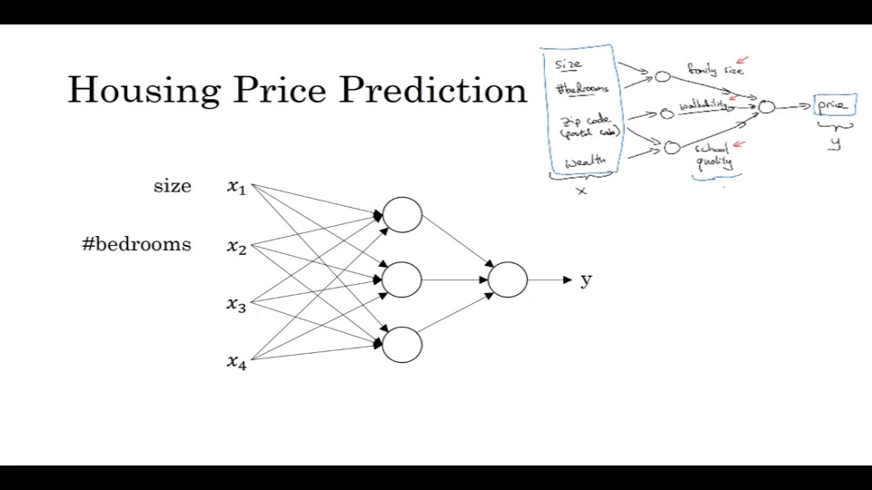
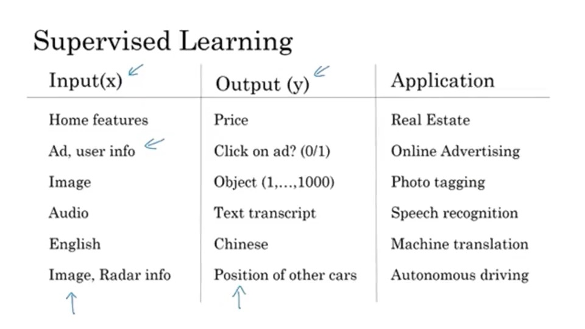
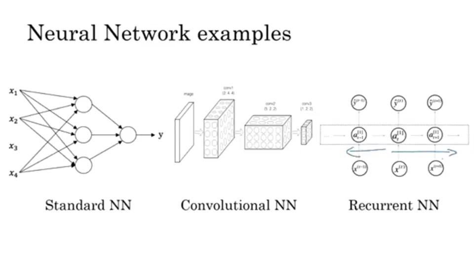
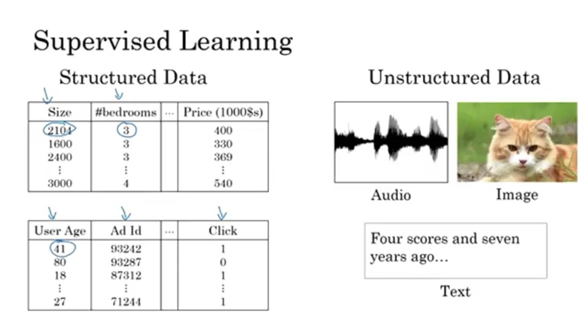

# Introduction to deep learning
## 1. what is a neural network?
### 1.1 最简单的神经网络
Size(x)-》⭕️-》Price(y) 这个⭕️可以说是一个神经元
* Relu function(Rectified Linerar Unite)
### 1.2 稍微复杂的神经网络
Size, #bedrooms,  ->  ⭕️  -> family Size -> Price  
Zip Code ->  ⭕️  -> walkbility -> Price  
如何训练神经网络呢？
你只需要给x的集合和y的集合，中间的网络会自己搞清楚

## 2. Supervised Learning with Neural Networks(监督学习)
### 2.1 一些实际应用例子

房价预测，广告投放运用标准神经网络  
图像处理运用卷积神经网 CNN  
处理序列号数据（音频，翻译）运用循环神经网络 RNN  
自动驾驶：混合神经网络  
### 2.2 神经网络的类型

### 2.3 数据类型
结构化数据（有明确定义的数据）和非结构化数据

## 3. Why is Deep Learning taking off?
主要有三个因素，数据量急剧增多， 计算能力增大， 算法层面上的创新  
Data, Computation, Algorithm

