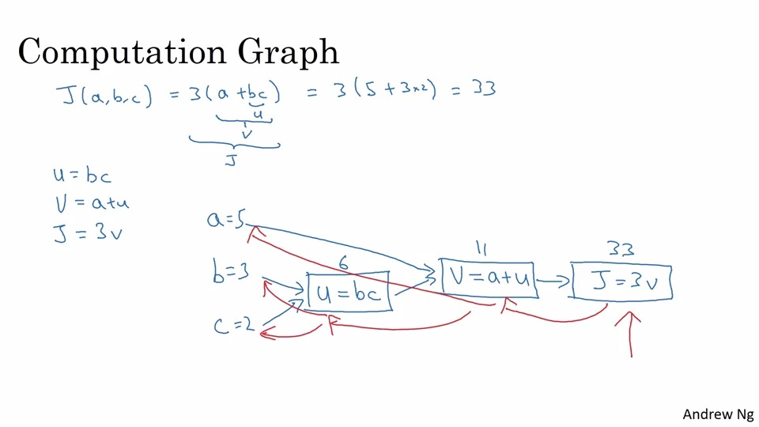
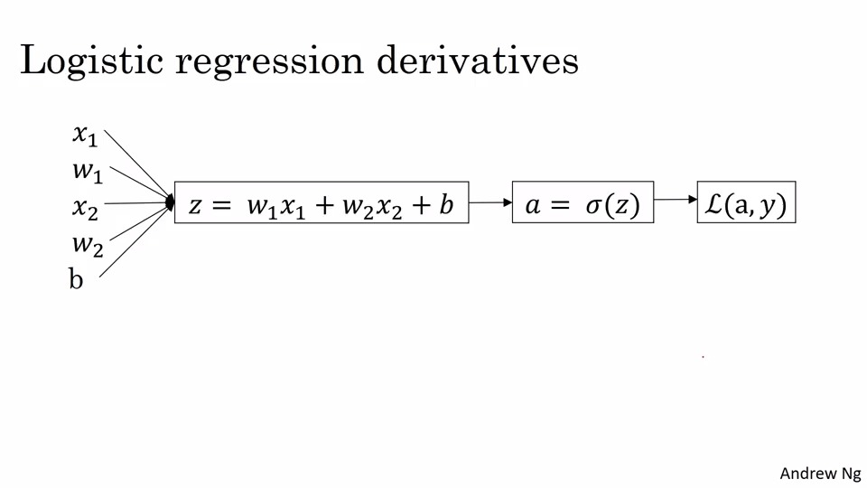
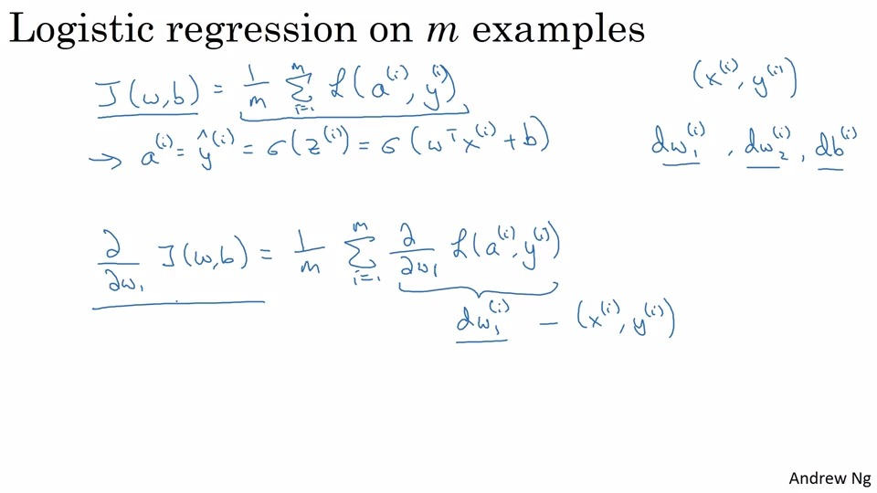
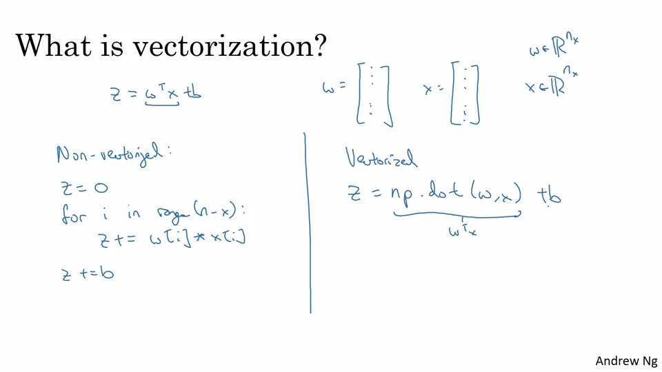
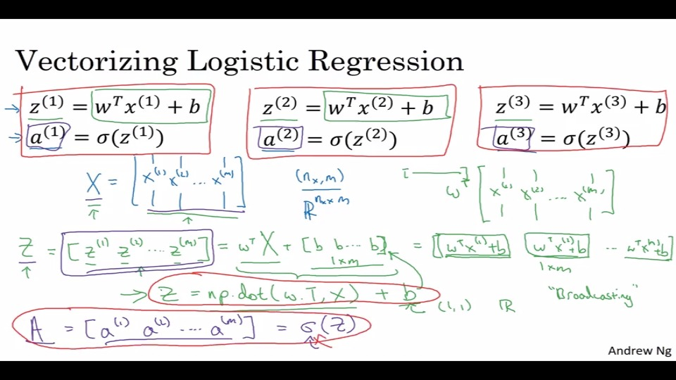
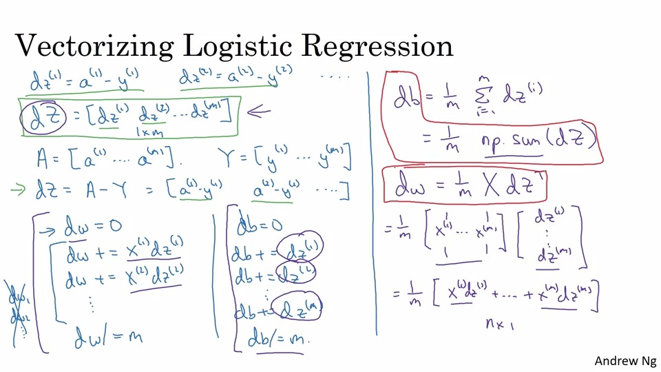
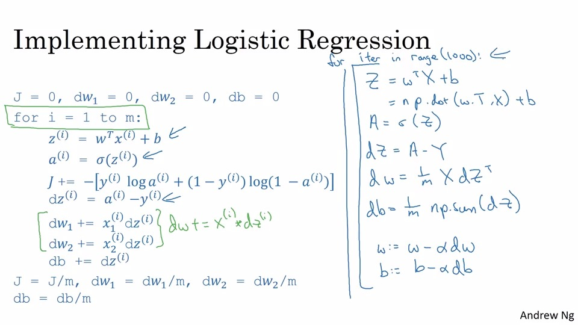
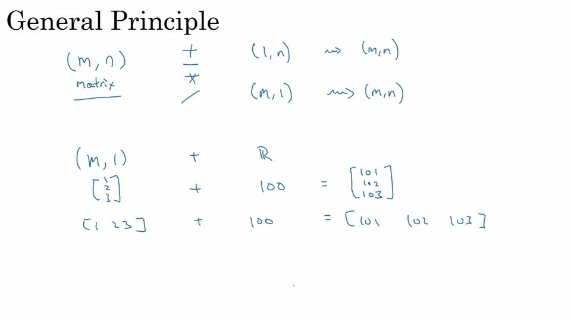

# Neural Network Basics
## 1. Binary Classification
例子： 判断图片是不是一只猫  
图片可以如下图在计算机存储，可以用一个向量x表示，输入为x(向量长度为n)，判断的结果为y


为了更加紧凑的训练，可以将所有的向量都表示成一个矩阵X,而Y为一个1XM的矩阵.


## 2. Logistic Regression(逻辑回归)
给一个向量x，想要获得yhat, 比如这张图片是猫的概率
使用sigmod函数让yhat的值处于0和1之间


## 3. Logistic Regression Cost Function（逻辑回归代价函数）
需要一个函数控制拟合的程度，可以用拟合的数据和实际的数据之间的方差，但是因为这是一个非凸的问题，所以在实际运用中不会使用方差作为代价函数. 下图中使用了一个代价函数，绿色部分证明是这个代价函数是有意义的。

* The difference between the cost function and the loss function for logistic regression: The loss function computes the error for a single training example; the cost function is the average of loss function of the entire training set.

## 4. Gradient Descent(梯度下降法)
梯度下降法是从初始点出发，逐步向陡的方向迭代。

阿尔法是步长（learning rate）, dw是斜率，梯度下降法会朝着全局最小值移动。

由于有两个参数w和b，所以可以在更新w和更新b之间进行循环迭代。


## 5. Derivatives(导数)
导数=斜率（slope）

## 6. More derivative examples
略

## 7. Computation graph
正向传播计算出神经网络的输出，反向计算出斜率/导数
J(a,b,c)=3(a+bc)
计算步骤：bc=u，V=a+u，J=3V  


## 8. Derivatives with a Computation Graph
略

## 9. Logistic Regerssion Gradient Descent


## 10. Gradient Descent on m Examples

可以用矢量化计算代替显式的For循环，提高代码的效率

# Python and Vectorization
## 11. Vectorization
- what is vectorization?

- 如果使用了bulit-in指令，比如np.dot，numpy就会利用并行化去更快的计算，GPU会更擅长做并行化计算
- 尽量使用显性的for循环

## 12. More Vectorization Examples
向量中的每个元素做指数计算, 对数计算，计算绝对值, 每当要用for循环时可以看一下是否可以利用numpy内置函数
```python
import numpy as np
u = np.exp(v)
np.log(v)
np.abs(v)
np.maxium(v, o)
```

## 13. Vertorizing Logistic Regression(计算推测值)


## 14. Vectorizing Logistic Regression's Gradient Output(计算梯度)



## 15. Broadcasting in Python
广播是python代码中使得特定代码更加高效的技术  
以下是广播的原则  


## 16. A note on python/numpy vectors
- 不要使用秩为1的矩阵
- 可以加入断言，减少bug
```python
assert(a.shape == (5, 1))
```

## 17. Quick tour of Jupyter/iPython Notebooks
略

## 18. Explanation of logistic regression cost function


