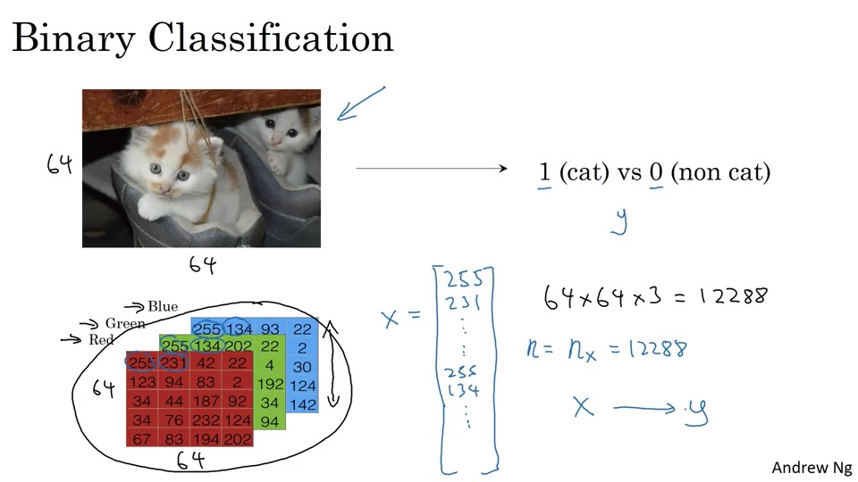
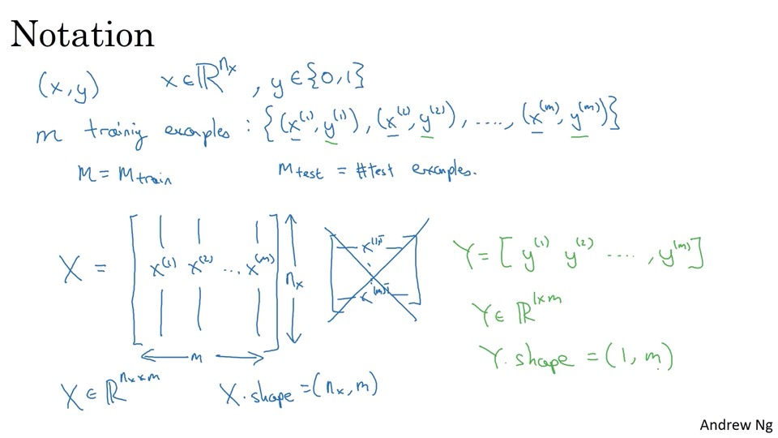
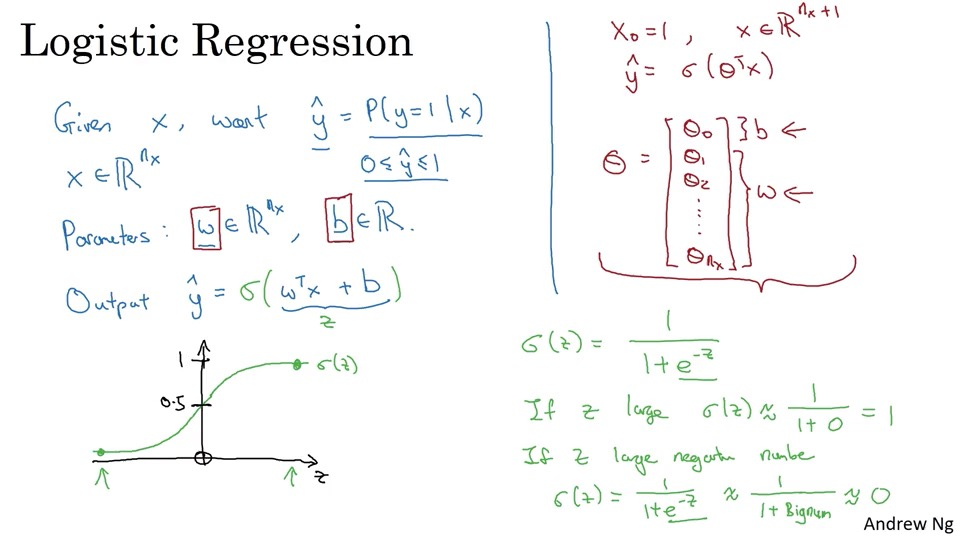
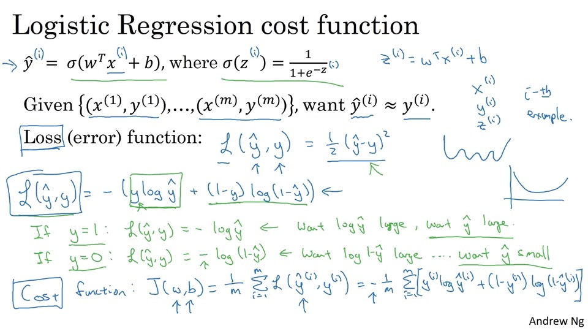
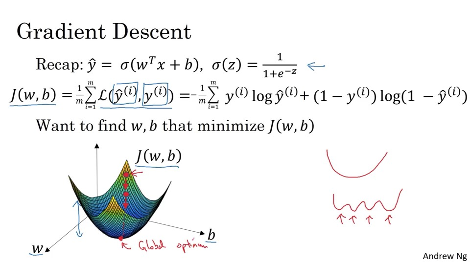
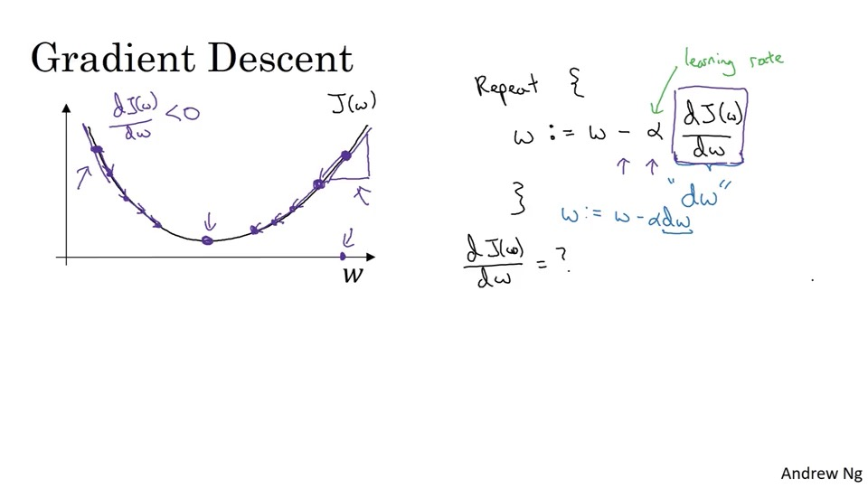

# Neural Network Basics
## 1. Binary Classification
例子： 判断图片是不是一只猫  
图片可以如下图在计算机存储，可以用一个向量x表示，输入为x(向量长度为n)，判断的结果为y

为了更加紧凑的训练，可以将所有的向量都表示成一个矩阵X,而Y为一个1XM的矩阵.

## 2. Logistic Regression(逻辑回归)
给一个向量x，想要获得yhat, 比如这张图片是猫的概率
使用sigmod函数让yhat的值处于0和1之间

## 3. Logistic Regression Cost Function（逻辑回归代价函数）
需要一个函数控制拟合的程度，可以用拟合的数据和实际的数据之间的方差，但是因为这是一个非凸的问题，所以在实际运用中不会使用方差作为代价函数. 下图中使用了一个代价函数，绿色部分证明是这个代价函数是有意义的。

* The difference between the cost function and the loss function for logistic regression: The loss function computes the error for a single training example; the cost function is the average of loss function of the entire training set.

## 4. Gradient Descent(梯度下降法)
梯度下降法是从初始点出发，逐步向陡的方向迭代。

阿尔法是步长（learning rate）, dw是斜率，梯度下降法会朝着全局最小值移动。

由于有两个参数w和b，所以可以在更新w和更新b之间进行循环迭代。

